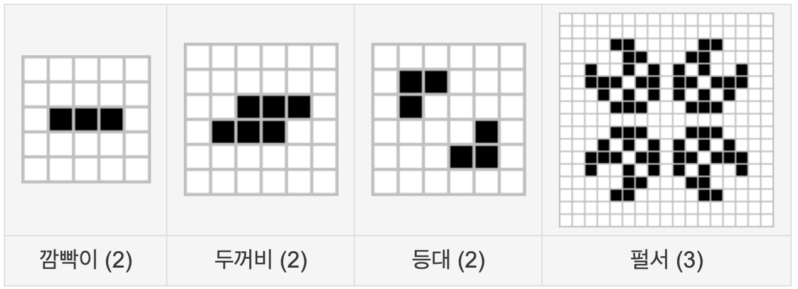

# Homework#6 - 라이프게임 애니메이션 (제출 마감: 11월 16일 15:00)
라이프게임 애니메이션은 바둑판 모양의 게임보드에서 돌아간다.

- 각 칸은 세포라고 부른다.
- 각 세포는 여덟개의 이웃세포와 인접해있다.
- 각 세포는 죽어있거나 살아있거나 두가지 상태 중 한가지 상태를 갖는다.
- 모든 세포의 상태는 주기적으로 동시에 변한다. 세대교체라고 한다.
- 현재 세대의 세포 전체의 상태가 다음 세대의 세포 전체의 상태를 결정한다.
- 각 세포의 다음 세대 상태는 8개의 이웃세포에 의해서 다음 규칙에 의해 결정된다.
  - 죽어있는 세포는 이웃세포 중 정확히 세 개가 살아있으면 살아난다.
  - 살아있는 세포는 이웃세포 중 2개 또는 3개가 살아있으면 생명을 유지하지만, 너무 적으면 ‘외로워서’ 너무 많으면 ‘숨막혀서’ 죽어버린다.

라이프게임은 초기 세대의 패턴에 따라서 다양한 세대교체가 이루어진다. 전혀 변화가 없는 패턴에서부터, 일정 주기로 반복하는 패턴, 계속 한쪽 방향으로 전진하는 패턴 등 다양한 패턴이 있다. (참고: https://namu.wiki/w/%EC%BD%98%EC%9B%A8%EC%9D%B4%EC%9D%98%20%EC%83%9D%EB%AA%85%20%EA%B2%8C%EC%9E%84)

이 중에서 진동주기가 상대적으로 짧은 아래 4개 패턴에 대해서 세대교체 과정을 애니메이션으로 보여주는 애플리케이션을 만들자. 사용자가 4개 중에서 하나를 선택하면 새로운 창을 띄워 애니메이션을 10초간 보여주면 된다.

