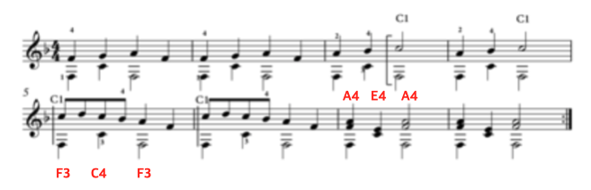

# Homework#1 (제출 마감 : 9월 14일 오전 11시)

```
SinOsc sound => dac;

261.6256 => float C4;
293.6648 => float D4;
329.6276 => float E4;
349.2282 => float F4;
391.9954 => float G4;
440 => float A4;
466.1638 => float Bb4;
493.8833 => float B;
C4*2 => float C5;
D4*2 => float D5;

0.3::second => dur beat;

0.5 => float volume;

for (0 => int i; i < 2; i++) {
  F4 => sound.freq;
  volume => sound.gain;
  beat => now;
  0 => sound.gain;
  beat => now;

  G4 => sound.freq;
  volume => sound.gain;
  beat => now;
  0 => sound.gain;
  beat => now;

  A4 => sound.freq;
  volume => sound.gain;
  beat => now;
  0 => sound.gain;
  beat => now;

  F4 => sound.freq;
  volume => sound.gain;
  beat => now;
  0 => sound.gain;
  beat => now;
}

for (0 => int i; i < 2; i++) {
  A4 => sound.freq;
  volume => sound.gain;
  beat => now;
  0 => sound.gain;
  beat => now;

  Bb4 => sound.freq;
  volume => sound.gain;
  beat => now;
  0 => sound.gain;
  beat => now;

  C5 => sound.freq;
  volume => sound.gain;
  beat*2 => now;
  0 => sound.gain;
  beat*2 => now;
}

for (0 => int i; i < 2; i++) {
  C5 => sound.freq;
  volume => sound.gain;
  beat/2 => now;
  0 => sound.gain;
  beat/2 => now;

  D5 => sound.freq;
  volume => sound.gain;
  beat/2 => now;
  0 => sound.gain;
  beat/2 => now;

  C5 => sound.freq;
  volume => sound.gain;
  beat/2 => now;
  0 => sound.gain;
  beat/2 => now;

  Bb4 => sound.freq;
  volume => sound.gain;
  beat/2 => now;
  0 => sound.gain;
  beat/2 => now;

  A4 => sound.freq;
  volume => sound.gain;
  beat => now;
  0 => sound.gain;
  beat => now;

  F4 => sound.freq;
  volume => sound.gain;
  beat => now;
  0 => sound.gain;
  beat => now;
}

for (0 => int i; i < 2; i++) {
  F4 => sound.freq;
  volume => sound.gain;
  beat => now;
  0 => sound.gain;
  beat => now;

  C4 => sound.freq;
  volume => sound.gain;
  beat => now;
  0 => sound.gain;
  beat => now;

  F4 => sound.freq;
  volume => sound.gain;
  beat => now;
  0 => sound.gain;
  beat => now;

  0 => sound.gain;
  beat*2 => now;
}

```chuck


위 코드를 확장하여 다음 트리오 곡을 연주하는 프로그램을 작성하자.



- 맨 아래음은 TriOsc를 사용하고, 다른 두 음은 SinOsc를 사용한다.
- 볼륨은 세 진동기 모두 0.3으로 맞춘다.

주의 사항
- 지금까지 배운 프로그래밍 지식만을 사용해야 한다.
- 완성한 hw1.ck 소스 파일을 블랙보드에 제출한다.
